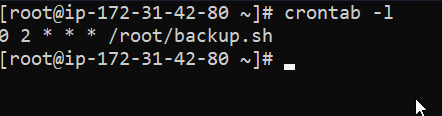
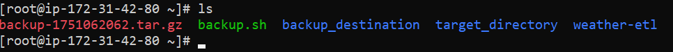
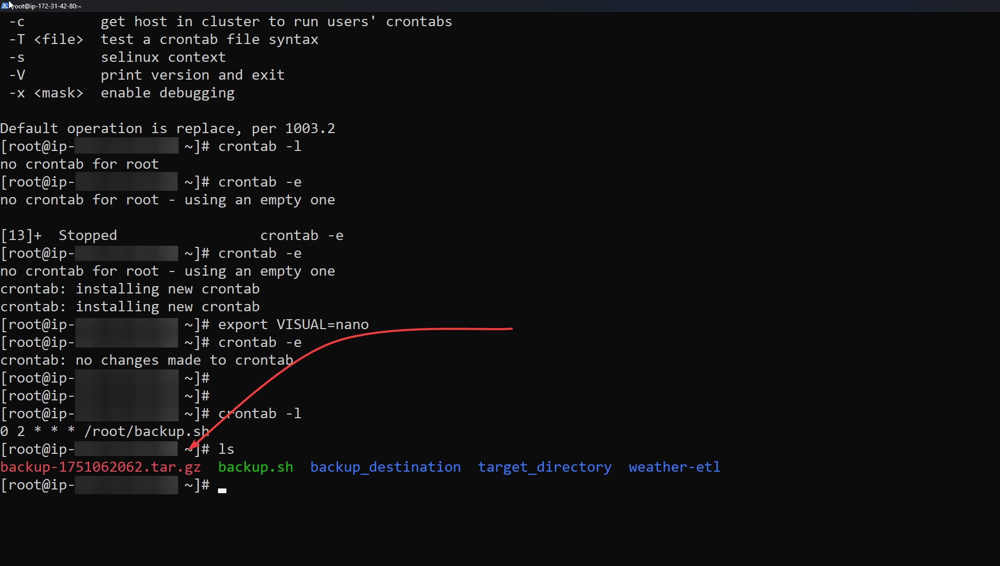

# 🛡️ Bash Backup Script

This is a simple Bash script to back up files modified within the last 24 hours from a **target directory** into a compressed `.tar.gz` archive, and then move it to a **destination directory**.

---

## 📜 How It Works

1. Reads target and destination directories from variables.
2. Identifies all files in the target directory modified in the last 24 hours.
3. Compresses them into a `.tar.gz` file.
4. Moves the backup to the destination directory.

---

## 🔧 Crontab Setup

You can automate this script using `crontab` to schedule daily backups:

```bash
0 2 * * * /path/to/backup.sh
```

This will run the script every day at 2 AM.



---

## ✅ Successful Backup

When the script completes successfully, the terminal will look something like this:



---

## 🗜️ Output Example

Your destination directory will contain a compressed archive named like this:



---

## 🧠 Notes

- Make sure the script has execute permission:  
  ```bash
  chmod +x backup.sh
  ```
---

## 💻 Code Breakdown

```bash
#!/bin/bash
```
Defines the interpreter to use for the script — in this case, `bash`.

```bash
targetDirectory="~/target_directory"
destinationDirectory="~/backup_destination"
```
Specifies the source directory to back up and the destination directory where the compressed file will be stored.  
> ⚠️ Note: Using `~` might not work with `realpath` — absolute paths are safer.

```bash
echo "Target Directory: $targetDirectory"
echo "Destination Directory: $destinationDirectory"
```
Prints the directories for confirmation/debugging.

```bash
currentTS=$(date +%s)
```
Gets the current Unix timestamp (seconds since 1970) to:
- Name the backup file.
- Compare file modification times.

```bash
backupFileName="backup-$currentTS.tar.gz"
```
Constructs a unique name for the backup archive.

```bash
origAbsPath=$(realpath "$targetDirectory")
destAbsPath=$(realpath "$destinationDirectory")
```
Resolves both paths to their absolute forms to avoid relative path issues.

```bash
cd "$origAbsPath"
```
Moves to the source directory.

```bash
yesterdayTS=$(($currentTS - 86400))
```
Calculates the timestamp for "24 hours ago" (86400 seconds).

```bash
declare -a toBackup
```
Initializes an array to store the names of files modified in the last 24 hours.

```bash
for file in $(ls); do
```
Loops over each file in the source directory.

```bash
    if [ $(date -r "$file" +%s) -ge $yesterdayTS ]; then
        toBackup+=("$file")
    fi
```
For each file, compares its last modification time with `yesterdayTS`.  
If it’s newer, adds it to the `toBackup` array.

```bash
tar -czf "$backupFileName" "${toBackup[@]}"
```
Creates a compressed `.tar.gz` archive containing only the recently modified files.

```bash
mv "$backupFileName" "$destAbsPath"
```
Moves the backup archive to the destination directory.

---

## Author

Made by [@abdlrhmanfahd](https://github.com/abdlrhmanfahd)
